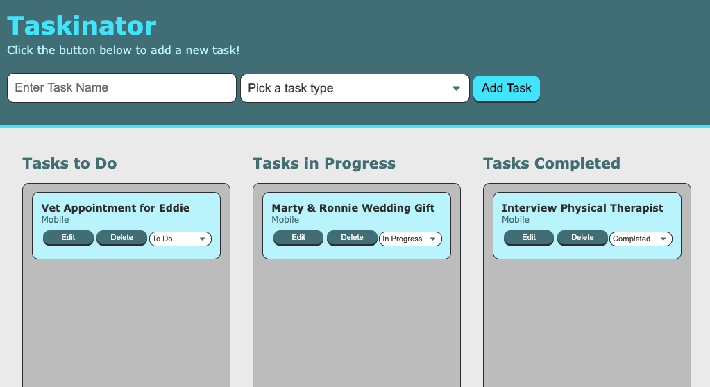

# Taskinator
Lesson 4 Practice Assignment | Web APIs

## Student Name
Tara Brichetto

## Creation Date
21 August 2020

## Purpose
This application was created as a practice assignment for the University of Arizona bootcamp. Taskinator is an online project tracker that uses the Kanban approach to organize tasks into columns. DOM API methods select and dynamically generate HTML elements and content.

## Languages
* HTML  
* CSS  
* JavaScript  

## Links
* Github Repository | https://github.com/tbrichet/taskinator  
* Deployed Application | https://tbrichet.github.io/taskinator/  

## Programs and Contributions
* Code created by University of Arizona  

## Screenshot

